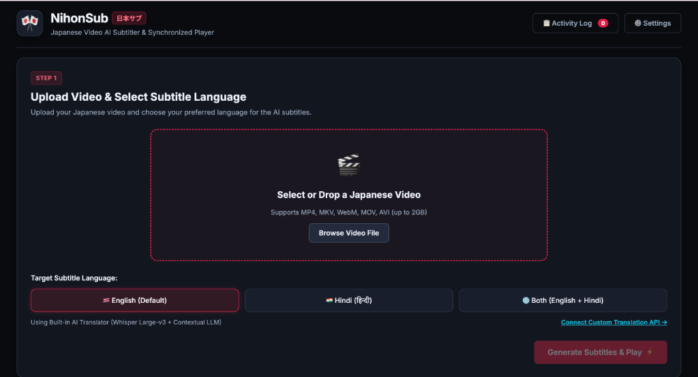
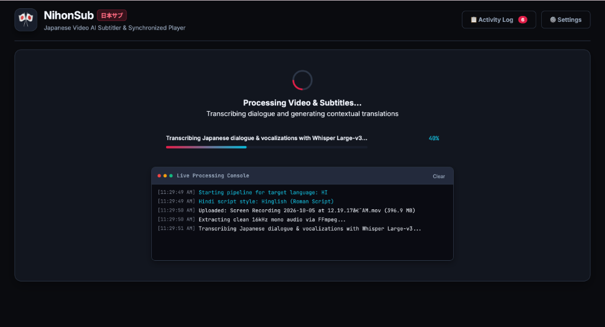
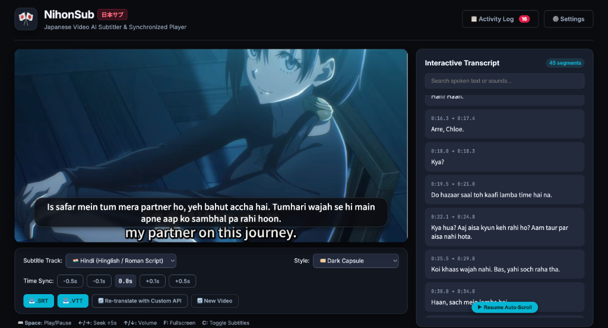

# 🎌 NihonSub (日本サブ)

> **Japanese Video AI Subtitler & Synchronized Cinema Player**  
> Fast, vocalization-aware Japanese speech recognition powered by **Whisper Large-v3**, paired with contextual LLM translation (**English & Hindi**), silence-detection chunking for long media, and an interactive synchronized video player.

---

## 📸 Screenshots

### 1️⃣ Step 1: Upload Video & Select Language Options


<br>

### ⚙️ Real-Time Transcription & Activity Console


<br>

### 2️⃣ Step 2: Synchronized Cinema Player & Interactive Transcript


---

## ✨ Features

- 🎙️ **Acoustic Vocalization Capture**: Captures natural Japanese dialogue, non-verbal vocal markers, sighs, grunts, moans, and emotional nuances that standard transcription tools often strip out.
- ✂️ **Lossless Silence-Detection Chunking**: Automatically analyzes waveforms with FFmpeg for natural pause intervals (`-30dB`, `d >= 0.5s`) for audio files longer than 10 minutes, preventing rate-limit issues and preserving sentence flow without mid-word cuts.
- 🌐 **Expressive Contextual Translation**:
  - **English**: Conversational dialogue with preserved emotion and subtitle action tags.
  - **Hindi (हिन्दी / Hinglish)**: 
    - **Devanagari (देवनागरी)**: Standard native Hindi script (e.g. *"नमस्ते, आप कैसे हैं?"*).
    - **Hinglish (Roman Script)**: Casual Roman alphabet conversational texting style (e.g. *"Namaste, aap kaise hain?"*).
  - **Bilingual Tracks**: Dual Japanese + English / Hindi / Hinglish display for language learners.
- ⚡ **Automatic Rate Limit Fallback**:
  - If Groq encounters an HTTP 429 rate limit during heavy batch translation, the engine automatically routes translation to **OpenRouter (DeepSeek)** or backs off gracefully.
- 🔌 **Custom Translation API / Agent Support**: Connect your own OpenAI-compatible `/chat/completions` endpoint (local Ollama, vLLM, custom agents, or proprietary LLMs) directly from the in-app UI.
- 🎬 **Cinema Player & Interactive Transcript**:
  - Live clickable transcript with keyword search and auto-scroll following video timecodes.
  - Cinema subtitle overlays with customizable styling (Transparent, Capsule, Classic Yellow Box).
  - WebVTT and SubRip (`.SRT`) instant exports.
  - Fullscreen support with native `::cue` rendering.

---

## 🛠️ Architecture

```
[Japanese Video File]
        │
        ▼ (FFmpeg Extraction)
[16kHz Mono Audio (Whisper Optimized)]
        │
        ├── If Duration > 10m ──► [Silence Detection Chunking]
        │                                 │
        ▼                                 ▼
[Groq Whisper Large-v3 API] ◄─────────────┘
        │
        ▼
[Japanese Dialogue & Timestamped Segments]
        │
        ▼ (Batch LLM Translation Pipeline)
[Groq LLaMA 3.3 / OpenRouter DeepSeek / Custom API]
        │
        ▼
[WebVTT & SRT Subtitles + Interactive Cinema Player]
```

---

## 📋 Prerequisites

1. **Node.js** (v18.0.0 or higher recommended)
2. **FFmpeg & FFprobe**:
   - **macOS** (via Homebrew):
     ```bash
     brew install ffmpeg
     ```
   - **Ubuntu / Debian**:
     ```bash
     sudo apt update && sudo apt install ffmpeg
     ```
   - **Windows** (via Scoop or Chocolatey):
     ```powershell
     scoop install ffmpeg
     # or
     choco install ffmpeg
     ```
3. **Groq API Key**: Get a free API key at [console.groq.com](https://console.groq.com/keys).
4. **OpenRouter API Key** *(Optional)*: For automatic rate-limit fallback at [openrouter.ai](https://openrouter.ai/keys).

---

## 🚀 Quick Start

### 1. Clone the Repository
```bash
git clone https://github.com/your-username/nihonsub.git
cd nihonsub
```

### 2. Install Dependencies
```bash
npm install
```

### 3. Configure Environment Variables
Copy `.env.example` to `.env`:
```bash
cp .env.example .env
```
Open `.env` and set your credentials:
```env
PORT=3000
GROQ_API_KEY=gsk_your_groq_api_key_here
OPENROUTER_API_KEY=sk-or-v1_optional_openrouter_key
```

### 4. Run the Application
You can use the startup script:
```bash
chmod +x run.sh
./run.sh
```
Or start directly with npm:
```bash
npm start
```

Open your browser at **`http://localhost:3000`**.

---

## ⌨️ Keyboard Shortcuts

| Shortcut | Action |
| :--- | :--- |
| <kbd>Space</kbd> | Play / Pause video |
| <kbd>←</kbd> / <kbd>→</kbd> | Seek backward / forward 5 seconds |
| <kbd>↑</kbd> / <kbd>↓</kbd> | Increase / decrease volume |
| <kbd>F</kbd> | Toggle Fullscreen |
| <kbd>C</kbd> | Toggle Subtitles On / Off |

---

## 📁 Project Structure

```
├── audioExtractor.js      # FFmpeg audio conversion, metadata & silence-detection chunker
├── transcriber.js         # Whisper Large-v3 client & multi-chunk coordinator
├── translator.js          # Contextual LLM translation pipeline with rate-limit fallback
├── subtitleGenerator.js   # WebVTT, SRT, and bilingual track compiler
├── server.js              # Express API server with NDJSON streaming telemetry
├── public/                # Frontend Web UI (HTML5, Vanilla JS, CSS3 Cinema Theme)
│   ├── index.html         # Main app markup & cinema player layout
│   ├── style.css          # Responsive styling, fullscreen ::cue, animations
│   └── app.js             # Player controls, SSE telemetry, transcript auto-scroll
├── storage/               # Ephemeral storage (uploads, audio, subtitles - gitignored)
├── run.sh                 # Linux / macOS quick startup script
└── package.json           # Node.js project manifest & dependencies
```

---

## 📄 License

MIT License. Feel free to use and modify for your personal and commercial projects.
